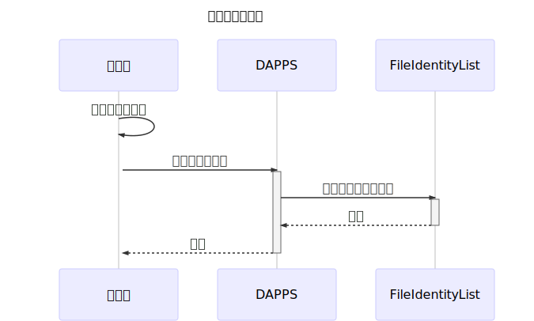
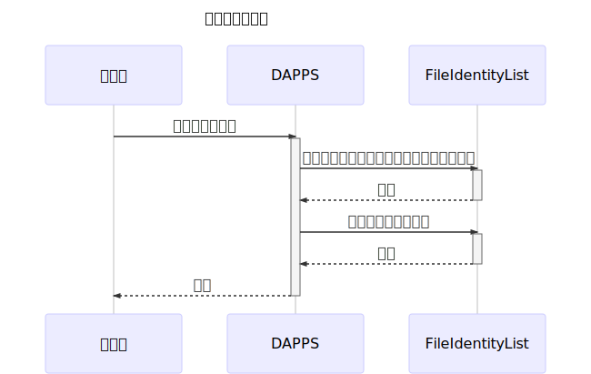
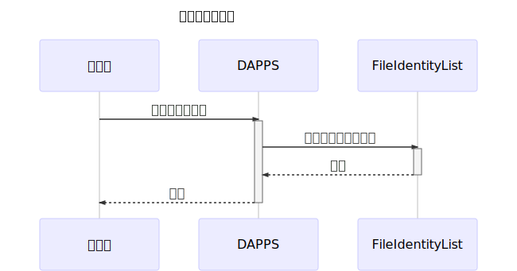

# Implementation that manages hash value of file data by block chain

## Overview

Use a smart contract to manage the hash value of data of a file in a block chain, and implement a mechanism to confirm that the file certainly existed at a certain point in time

## Main point

Person who wants to register the file => Person who wants to confirm the registrant file => Verifier

I will call it.

※ Verifier may be a registrant

## Information managed by block chain

- Hash value of file information (Keccak-256 Hash generated inside Smart Contract)
- Hash value of file information (SHA3 Hash received by Smart Contract at registration)
- Registered user's ETH address
- Time stamp when the information was taken into the blockchain

## What can be achieved by this Dapps

As file information is recorded, there is no concern such as falsification of the record

## Task

- File registrant needs to pay GAS
- Are registered files still present in the future? Can not manage
- If you want to manage file information elsewhere (store to IPFS?)

## specification

### File registration

*argument*

string _sha3hash: SHA3 hash value of the file to be registered

*function*

```solidity
function registerFileHash(string _sha3hash) public returns (bool);
```



### Erase file

*argument*

bytes32 _keccak 256hash: keccak 256 Hash of the file to be deleted

*function*

```solidity
function removeFileHash(bytes32 _keccak256hash) public returns (bool);
```



### File verification

*argument*

bytes32 _keccak256hash: keccak256 Hash of the file to be verified

*function*

```solidity
function isExist(bytes32 _keccak256hash) public view returns (bool);
```

```
function getFileIdentity(bytes32 _keccak256hash) public view returns (bytes32 keccak256hash, string sha3hash, address registrant, uint timestamp, uint isExist)
```



## Implementation

Implementation will be released on GitHub.

https://github.com/PLUSPLUS-JP/file-identity-verification
